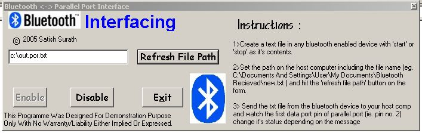



## simplified bluetooth \- parallel port interface

### Description

this is a stripped, simplified, elegant yet powerful way to acess a host's parallel port via a bluetooth device wirelessly
 
### More Info
 
people.. please please.. before you start complaining.. you need to download a io.dll file from geekhideout.com and paste it to your c:\Windows\System\ folder to acess your parallel port.. also you can download the 'paramon.exe' which is a great software to monitor your status of your parallel port..(also available on geekhideout.com)

             |
---                |---
**Submitted On**   |2005-08-25 11:57:16
**By**             |[Satish Surath](https://github.com/Planet-Source-Code/PSCIndex/blob/master/ByAuthor/satish-surath.md)
**Level**          |Beginner
**User Rating**    |3.8 (15 globes from 4 users)
**Compatibility**  |VB 5\.0, VB 6\.0
**Category**       |[Complete Applications](https://github.com/Planet-Source-Code/PSCIndex/blob/master/ByCategory/complete-applications__1-27.md)
**World**          |[Visual Basic](https://github.com/Planet-Source-Code/PSCIndex/blob/master/ByWorld/visual-basic.md)
**Archive File**   |[simplified1927298252005\.zip](https://github.com/Planet-Source-Code/satish-surath-simplified-bluetooth-parallel-port-interface__1-62321/archive/master.zip)

